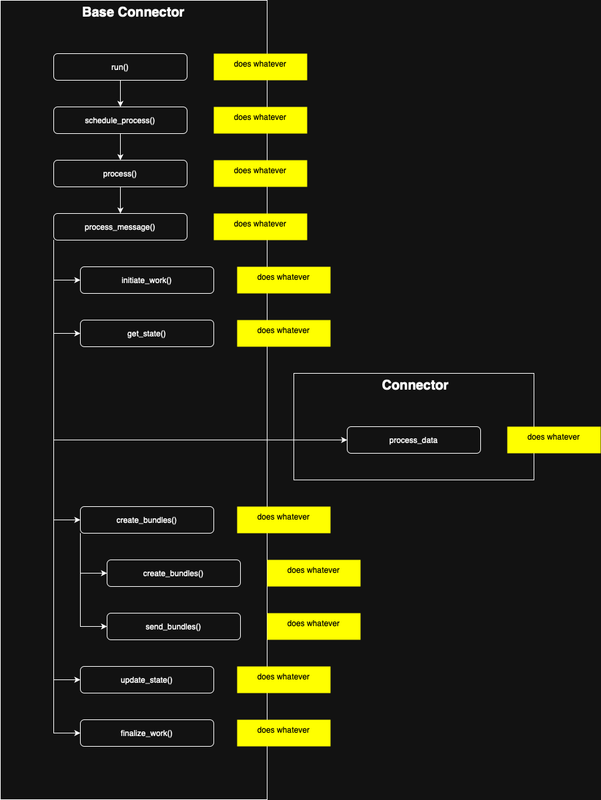

# Connector SDK

## BaseConnector

To Edit the graph, go to the link bellow then in draw.io do `File -> Export as -> PNG... -> [X] include a copy of my diagram -> Export -> Save -> OK -> OK`

[Open schema in Draw.io](https://app.diagrams.net/#HPowlinett%2Fconnectors%2Ffeat%252Fadd-base-external-import%2Fshared%2Fconnectors_sdk%2Fgraph_base_connector.drawio)

